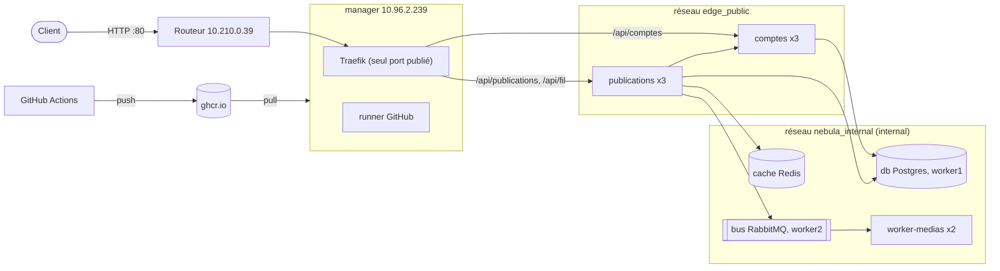

# Nebula - Architecture

Projet ESGI « Clusterisation de conteneurs » : le réseau social Nebula (code fourni) déployé sur un cluster Docker Swarm de trois VM.

Voir aussi : [Procédures](procedures.md), [Scénarios](scenarios.md), [Vérification](verification.md).

## Schéma

## Machines

| Nœud | IP | Rôle | Label | Héberge |
|---|---|---|---|---|
| manager | 10.96.2.239 | manager | - | Traefik, runner, services sans état, cache |
| worker1 | 10.96.2.240 | worker | `nebula.db=true` | db seule |
| worker2 | 10.96.2.241 | worker | `nebula.bus=true` | bus, services sans état, cache |

VM Debian 13 sur Proxmox, 2 vCPU, 2 Go, 10 Go. Accès : `ssh manager|worker1|worker2` via `ProxyJump router`.

## Services

| Service | Image | Replicas | Placement | Mise à jour |
|---|---|---|---|---|
| traefik | `traefik:v3.7.13` | 1 | manager | stop-first |
| comptes | `ghcr.io/matheowintrebert/nebula-comptes:<tag>` | 3 | pas sur worker1 | start-first, rollback |
| publications | `.../nebula-publications:<tag>` | 3 | pas sur worker1 | start-first, rollback |
| worker-medias | `.../nebula-worker-medias:<tag>` | 2 | pas sur worker1 | start-first, rollback |
| db | `postgres:18.6-alpine` | 1 | worker1 | stop-first |
| cache | `redis:8.10.2-alpine` | 1 | pas sur worker1 | start-first |
| bus | `rabbitmq:4.3.6-alpine` | 1 | worker2 | stop-first |

Chaque service a une limite mémoire et un healthcheck.

## Routage

| URL | Service |
|---|---|
| `/api/comptes...` | comptes (reçoit `/comptes...`) |
| `/api/publications`, `/api/fil` | publications |
| `/api/<service>/health` | `/health` du service |
| `admin.nebula.test/dashboard/` | tableau de bord Traefik (IP autorisées + mot de passe) |

Le routage est dans les labels de chaque service. Ajouter un service ne touche pas Traefik.

## Fonctionnement

- Traefik répartit les requêtes entre les replicas.
- publications vérifie l'auteur auprès de comptes.
- Une publication envoie un message dans la file `publications`. worker-medias le traite et écrit un fichier dans son volume. Les messages en échec vont dans `publications.erreurs`.
- `GET /fil` passe par Redis (30 s).

## Réseaux

- `edge_public` : overlay partagé avec Traefik.
- `nebula_internal` : overlay `internal: true`. db, cache et bus ne sont que là.
- MTU 1300 partout (Proxmox est à 1350, VXLAN prend 50 octets).

## Secrets

Créés sur le manager par `scripts/secrets-init.sh`, jamais dans Git : `db_user`, `db_password`, `redis_conf`, `redis_url`, `rabbitmq_users`, `amqp_url`, `traefik_users`. Le mot de passe admin est dans `~/.nebula/admin-password` sur le manager.

Les configs Swarm sont immuables : on change le suffixe `_vN` à chaque modification.

## Livraison

- `build.yml` (push sur `main`) : construit les images, tag `<VERSION>-<sha7>`, scan Trivy, push sur ghcr.io.
- `deploy.yml` (manuel) : tourne sur le runner du manager et lance `scripts/deploy.sh <tag>`. Rien n'est reconstruit.
- `defect.yml` (manuel) : publie une image `comptes` cassée pour le scénario 8.

## Mises à jour

Services sans état : un replica à la fois, le nouveau doit être sain avant l'arrêt de l'ancien, retour arrière automatique en cas d'échec.

Pour éviter les erreurs pendant la mise à jour, un conteneur continue de répondre 8 s après SIGTERM, le temps que Traefik le retire. Traefik a aussi un timeout de connexion de 1 s et 3 essais.

## Suivi

- `make status` : services, replicas, tag, nœud.
- `/health` renvoie `{service, version, host}`.
- Logs : `docker service logs nebula_<service>`.

## Limites

- Un seul manager : s'il tombe, plus d'orchestration ni d'accès HTTP (les conteneurs continuent).
- Une seule base. Si worker1 est perdu, on restaure la sauvegarde.
- Volumes locaux : `db_data` sur worker1, `bus_data` sur worker2.
- Après le retour d'un nœud, il faut rééquilibrer avec `docker service update --force`.
- Pas de TLS.
- La mise à jour de Traefik coupe quelques secondes.
- Domaine `nebula.test` car `.local` est pris par mDNS.
