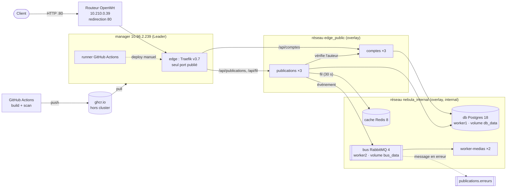

# Nebula

## Overview

Projet ESGI « Clusterisation de conteneurs » : déployer et exploiter le réseau social Nebula sur un cluster **Docker Swarm de trois VM** (Docker Engine 29.8.2). Le code applicatif est fourni ; tout ce qui est évalué est l'infrastructure : cluster, réseaux, placement, secrets, mises à jour, registry, livraison, procédures.

- Dépôt : https://github.com/MatheoWintrebert/nebula (privé) — local `/mnt/D/Work/Projects/nebula`
- Cahier des charges : `~/Downloads/Nebula_Cahier_des_charges_v6.pdf`
- Procédures : [Procédures](procedures.md) · Vérifications : [Scénarios](scenarios.md)

## Architecture

### Les trois machines

| Nœud | IP | Rôle | Étiquette | Héberge |
|---|---|---|---|---|
| manager | 10.96.2.239 | manager (Leader) | — | Traefik, runner, services sans état, cache |
| worker1 | 10.96.2.240 | worker | `nebula.db=true` | **db uniquement** |
| worker2 | 10.96.2.241 | worker | `nebula.bus=true` | bus, services sans état, cache |

VM Debian 13 sur Proxmox, 2 vCPU / 2 Go / 10 Go chacune. IP et passerelle fixées par Cloud-Init (les changer = *Regenerate Image* + redémarrage à froid). Accès SSH : `ssh manager|worker1|worker2` avec `ProxyJump router`.

### Les sept services

| Service | Image | Replicas | Réseaux | Placement | Mise à jour |
|---|---|---|---|---|---|
| edge (Traefik) | `traefik:v3.7.13` | 1 | edge_public | `node.role == manager` | stop-first (port en mode host) |
| comptes | `ghcr.io/matheowintrebert/nebula-comptes:<tag>` | 3 | edge_public + internal | `nebula.db != true`, étalé | start-first, rollback |
| publications | `…/nebula-publications:<tag>` | 3 | edge_public + internal | idem | start-first, rollback |
| worker-medias | `…/nebula-worker-medias:<tag>` | 2 | internal | idem | start-first, rollback |
| db | `postgres:18.6-alpine` | 1 | internal | `nebula.db == true` | **stop-first** (un seul écrivain sur le volume) |
| cache | `redis:8.10.2-alpine` | 1 | internal | `nebula.db != true` | start-first (aucune donnée) |
| bus | `rabbitmq:4.3.6-alpine` | 1 | internal | `nebula.bus == true` | stop-first (volume) |

Chaque service a une limite mémoire (128 Mo pour les services applicatifs, 512 Mo pour db et bus, 96 Mo pour le cache) et une sonde de santé (dans l'image pour les services applicatifs, dans la stack pour db/cache/bus/Traefik).

### Routage (Traefik, un seul port)

| URL publique | Service | Chemin reçu |
|---|---|---|
| `/api/comptes`, `/api/comptes/{id}` | comptes | `/comptes…` (middleware `strip-api`) |
| `/api/publications`, `/api/fil` | publications | `/publications`, `/fil` |
| `/api/<service>/health` | le service | `/health` (middleware `health`) |
| `admin.nebula.test/dashboard/`, `/metrics` | tableau de bord Traefik, métriques Prometheus | liste blanche IP + mot de passe |

Le routage vit dans les **labels de chaque service**. Les middlewares partagés (`strip-api`, `health`, `retry`) sont définis une seule fois sur Traefik : un 8ᵉ service ne modifie ni Traefik ni les sept autres.

### Flux

1. **Requête** : client → routeur:80 → Traefik (manager, mode host : il voit la vraie IP client) → un replica sur `edge_public`, en répartition par tâche (round-robin sur les IP des tâches).
2. **Inter-services** : publications appelle `http://comptes:3000` (VIP Swarm) pour vérifier l'auteur.
3. **Asynchrone** : publications insère en base, publie `{publication_id, auteur_id, horodatage}` dans la file durable `publications`, répond 201. worker-medias consomme (prefetch 1, 1,5 s par message) et écrit une trace dans son volume. Un message qui échoue est rejeté sans remise en file, et la politique `publications-dlx` le range dans **`publications.erreurs`** : les erreurs restent visibles.
4. **Cache** : `GET /fil` lit Redis (clé `fil:20`, TTL 30 s), sinon la base. Une publication invalide la clé.

### Réseaux

- `edge_public` : overlay *attachable*, créé par `deploy.sh`, partagé entre la stack `edge` et les services routés.
- `nebula_internal` : overlay **`internal: true`**. Ni entrée ni sortie hors du cluster ; db, cache et bus n'existent que là.
- MTU des overlays : **1300** (le réseau Proxmox est à 1350, VXLAN ajoute 50 octets). Sans cela, les petites requêtes passent mais les grosses réponses se bloquent. `ingress` a été recréé à 1300.
- Ports Swarm entre nœuds : 2377/tcp (gestion), 7946/tcp+udp (découverte), 4789/udp (VXLAN).

### Secrets et configurations

Créés sur le manager par `scripts/secrets-init.sh` (valeurs aléatoires, idempotent), **jamais dans Git** (scan `gitleaks` avant chaque commit) :

| Secret | Contenu | Utilisé par |
|---|---|---|
| `db_user`, `db_password` | identifiants Postgres | db (`POSTGRES_*_FILE`), comptes, publications, sauvegarde |
| `redis_conf` / `redis_url` | `requirepass` + config / URL avec mot de passe | cache / publications (`REDIS_URL_FILE`) |
| `rabbitmq_users` / `amqp_url` | utilisateur en empreinte SHA-256 salée / URL AMQP | bus / publications, worker (`AMQP_URL_FILE`) |
| `traefik_users` | `admin:<htpasswd apr1>` | tableau de bord Traefik |

Le mot de passe admin en clair est seulement dans `~/.nebula/admin-password` (0600) sur le manager.
Configs Swarm (non sensibles, versionnées) : `nebula_db_init_v1` (schéma), `nebula_rabbitmq_conf_v2`, `nebula_rabbitmq_topology_v1` (file d'erreurs + politique). Comme une config est immuable, toute modification passe par un nouveau suffixe `_vN`.

### Livraison (registry hors cluster)

- **Registry : ghcr.io.** Hors du cluster, comme exigé : redémarrer le cluster ne dépend pas du cluster.
- **build.yml**, à chaque push sur `main` qui touche `services/` :
  - construit les 3 images, tag immuable **`<VERSION>-<sha7>`** (ex. `1.0.0-19f846e`, jamais `latest`) ;
  - écrit ce tag dans `APP_VERSION` et le SHA complet dans le label OCI `revision` ;
  - lance une analyse **Trivy bloquante** (faille CRITICAL corrigeable = image non publiée), puis pousse.
- **deploy.yml**, manuel (*Actions → deploy → Run workflow*, saisie du tag) :
  - s'exécute sur le runner auto-hébergé du manager, qui ne fait que des connexions sortantes : aucun port à ouvrir ;
  - vérifie que les images existent, puis lance `scripts/deploy.sh <tag>` ;
  - **ne reconstruit jamais** : c'est l'image testée par la CI, et `docker stack deploy` la résout en digest.
- **defect.yml**, manuel : publie `comptes:<tag>-defect`, une image dont la sonde de santé échoue toujours, pour le scénario 8.
- **Identifiants** :
  - push : `GITHUB_TOKEN` éphémère ;
  - pull : secret de dépôt `GHCR_PULL_TOKEN` (PAT `read:packages` seul), transmis aux nœuds par `--with-registry-auth` ;
  - runner : jeton d'enregistrement à usage unique.

### Mises à jour et retour arrière

- **Paramètres des services sans état** :
  - `parallelism: 1`, `delay: 5s`, `order: start-first`, `monitor: 30s`, `failure_action: rollback`, `max_failure_ratio: 0` ;
  - `rollback_config` : start-first, 1 à la fois.
- **Pourquoi c'est sans coupure** :
  - Avec un `HEALTHCHECK`, une tâche reste *starting* tant qu'elle n'est pas saine. Traefik ne route que vers les tâches *running*, et Swarm n'arrête l'ancien replica qu'une fois le nouveau sain.
  - **Drain de 8 s** : le `CMD` des images routées intercepte SIGTERM, continue à servir 8 s, puis transmet le signal à Node (`server.close`). Traefik relit le cluster toutes les 5 s : il a retiré le replica avant que son IP disparaisse. Sans ce délai, on a mesuré 6 requêtes sur 463 en échec : Traefik visait l'IP d'un conteneur déjà supprimé et attendait 30 s de délai de connexion.
  - Filet de sécurité : `dialTimeout=1s` côté Traefik + middleware `retry` (3 essais). Une cible morte échoue vite et la requête part vers un autre replica.
  - `stop_grace_period: 20s` > 8 s de drain + arrêt de Node.
- **Échec** : une version qui ne devient jamais saine est retirée et le service revient seul à la version précédente. `docker service ps` montre la tâche `Failed` et l'état `rollback_completed`.

### Traçabilité

- `make status` (`scripts/status.sh`) répond en une commande : quels services, combien de replicas, quelle image (tag), sur quel nœud.
- `/health` renvoie `{service, version, host}`. Le hostname est l'ID du conteneur, ce qui prouve la répartition.
- Journaux : `docker service logs nebula_<service>` pour tout le service, `docker service logs <id-de-tâche>` pour une instance. Rotation : 10 Mo × 3 (`daemon.json`).

## Key Decisions

- **1 manager + 2 workers plutôt que 3 managers.**
  - Le quorum Raft vaut ⌊n/2⌋+1. Trois managers tolèrent la perte d'un seul, mais chaque nœud porterait aussi la charge applicative et le plan de contrôle.
  - Ici la perte du manager **n'arrête pas les conteneurs** : seules l'orchestration (reprogrammation, mises à jour) et le point d'entrée sont indisponibles jusqu'à son retour.
  - En contrepartie, la topologie est simple et lisible, et l'arrêt/redémarrage est déterministe (un seul leader possible). Deux managers seraient pire qu'un (quorum de 2 sur 2).
  - Limite assumée : le manager est un point unique de défaillance pour le contrôle et l'entrée HTTP.
- **Traefik (fourni) plutôt que nginx.** Il découvre les services par leurs labels, donc le point d'entrée ne bouge pas quand un service est ajouté (scénario 10). Mis à jour de v3.3 à **v3.7.13**, car Docker 29 a relevé l'API minimale à 1.44 et les anciennes versions ne pouvaient plus parler au démon.
- **Port 80 en mode host sur le manager**, pas en ingress : Traefik voit l'IP réelle du client (liste blanche admin, journaux d'accès). Contreparties : Traefik se met à jour en stop-first (quelques secondes de coupure sur une mise à jour de l'edge seulement), et sa montée en charge est limitée au(x) manager(s).
- **Tableau de bord sans `api.insecure`** et sans port 8088 : il passe sur le port 80, `Host(admin.nebula.test)`, liste blanche IP + basic auth (secret).
- **Machine de la base réservée** : les services sans état ont la contrainte `node.labels.nebula.db != true`, la base ne partage donc pas ses 2 Go de RAM.
- **RabbitMQ (et pas NATS)**, imposé de fait par le code (`amqplib`). La file d'erreurs passe par une *politique* et non par des arguments de file, ce qui évite un conflit avec l'`assertQueue` de l'appli.
- **Bus avec volume et `hostname: bus`** : les messages durables survivent à un redémarrage (le nom de nœud Erlang doit être stable pour que RabbitMQ relise son volume).
- **Cache sans volume** : Redis lancé avec `save ""` et `appendonly no` ; ses données sont volatiles par conception.
- **Code applicatif modifié de 3 lignes** pour lire `AMQP_URL` et `REDIS_URL` via `*_FILE`, comme `POSTGRES_*` : sans cela, ces mots de passe auraient été en clair dans la stack.
- **Utilisateur RabbitMQ importé par définitions** : dès qu'on importe des définitions au démarrage, RabbitMQ ne crée plus `default_user`. D'où un fichier d'utilisateurs (secret) à côté de la topologie (config).
- **GitHub (dépôt privé + Actions + ghcr.io)** plutôt qu'un registry auto-hébergé : rien à maintenir, hors cluster par construction. Le runner auto-hébergé sur le manager n'ouvre aucun port entrant.
- **Sauvegardes sur le manager**, pas sur worker1 : une sauvegarde sur la machine de la base disparaîtrait avec elle.

## Hypothèses et limites

- Un seul manager : sa panne gèle l'orchestration et coupe l'entrée HTTP (les conteneurs des workers continuent).
- Une seule instance de base (hors périmètre : HA du plan de données). Si worker1 est perdu, on restaure depuis la dernière sauvegarde sur une machine étiquetée `nebula.db=true`.
- Les volumes sont **locaux** : `db_data` n'existe que sur worker1, `bus_data` que sur worker2. La contrainte de placement est ce qui garantit qu'un redémarrage retrouve les données.
- Après le retour d'un nœud, Swarm ne rééquilibre pas tout seul : on le fait avec `docker service update --force` (voir procédures).
- Pas de TLS (bonus, hors périmètre). Le mot de passe admin circule donc en basic auth sur HTTP dans le réseau de l'école.
- Mise à jour de l'edge : stop-first, donc quelques secondes d'indisponibilité ; les mises à jour des services applicatifs, elles, sont sans coupure.
- Nom de domaine `nebula.test` et non `nebula.local` : `.local` est réservé à mDNS, et sur Linux (`nss-mdns`) comme sur macOS, `/etc/hosts` est ignoré pour ce suffixe.
- Le worker écrit dans `/data`, que son image crée avec le propriétaire `node`. Un volume nommé neuf hérite de ce propriétaire ; sinon il appartient à root et chaque message part en erreur (cas rencontré : les deux messages de `publications.erreurs`).

## Links

- [Procédures](procedures.md)
- [Scénarios](scenarios.md)
- Mémo cluster : MTU 1300 sur tout overlay, ProxyJump `router` (10.210.0.39), NetBird hors campus.
